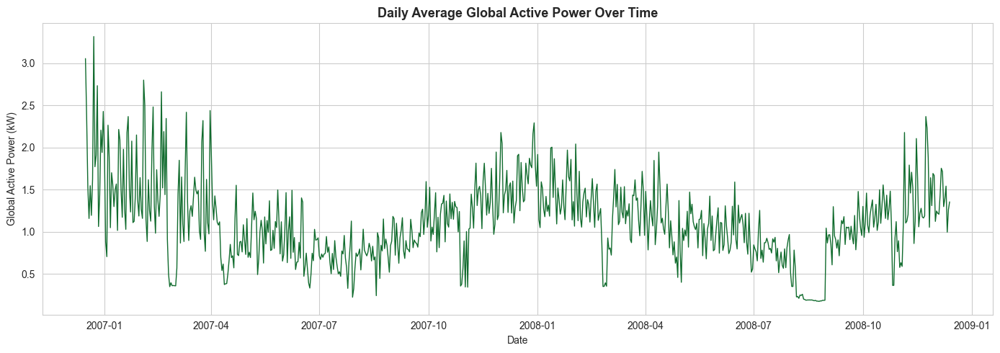

# Household-Power-Consumption-Forecasting

Time series forecasting of daily household electricity consumption using the UCI Individual Household Electric Power Consumption dataset. Built as part of a Data Science internship task.

---

## 1. Objective

Utility companies and homeowners benefit from being able to forecast future electricity usage, whether for grid load balancing, cost planning, or energy-saving decisions. This project builds a complete pipeline that:

- Cleans and aggregates over 1 million minute-level smart meter readings into a daily time series
- Explores consumption trends, seasonality, and weekday/weekend patterns
- Engineers lag and rolling-window features for forecasting
- Trains and compares multiple regression models to **forecast next-day Global Active Power consumption**
- Extracts practical insights for energy planning

---

## 2. Project Structure

```
household-power-consumption-forecasting/
│
├── household_power_forecasting.ipynb   # Main Jupyter Notebook (full pipeline)
├── household_power_consumption.csv     # Raw dataset (minute-level readings)
├── README.md                           # Project documentation
│
└── images/                             # Exported visualizations
    ├── Plot1_Daily_avg_power.png
    ├── Plot2_monthly_avg_power_consumption.png
    ├── Plot3_avg_power_consumption_dayperweek.png
    ├── Plot4_seasonal_decomposition.png
    ├── Plot5_avg_energy_submeetingzone.png
    ├── Plot6_correlation.png
    ├── Plot7_distribution.png
    ├── Plot8_model_comparison.png
    ├── Plot9_actual_predicted.png
    ├── Plot10_residuals_distri_predicted.png
    └── Plot11_feature_coefficients.png
```

---

## 3. Dataset Overview

**Source:** UCI Machine Learning Repository *Individual Household Electric Power Consumption*

| Property | Detail |
|---|---|
| Records | 1,048,575 minute-level readings |
| Date range | 16 Dec 2006 – 13 Dec 2008 |
| Resolution | 1-minute intervals |
| Missing values | 4,069 rows (0.39%), marked as `?` in raw file |

**Columns:**

| Column | Description |
|---|---|
| `Date`, `Time` | Timestamp of reading |
| `Global_active_power` | Household global active power (kW) **forecast target** |
| `Global_reactive_power` | Household global reactive power (kW) |
| `Voltage` | Minute-averaged voltage (V) |
| `Global_intensity` | Minute-averaged current intensity (A) |
| `Sub_metering_1` | Kitchen energy (Wh) |
| `Sub_metering_2` | Laundry room energy (Wh) |
| `Sub_metering_3` | Water heater & AC energy (Wh) |

---

## 4. Technical Approach

1. **Data Cleaning:** Missing values (`?`) were converted to `NaN`; `Date` + `Time` were merged into a proper datetime index.
2. **Resampling:** Minute-level data aggregated to **daily averages** (729 days); this makes the forecasting horizon practical and reduces noise.
3. **Interpolation:** 7 residual missing days after resampling were filled via linear interpolation.
4. **Feature Engineering:**
   - Calendar features: day of week, month, weekend flag
   - Lag features: previous 1, 2, 3, 7, and 14 days of consumption
   - Rolling statistics: 7-day and 14-day rolling mean, 7-day rolling std
   - Final modeling dataset: 715 days × 11 features
5. **Train/Test Split:** Chronological split (not random) to simulate real forecasting: 572 days train (Dec 2006 – Jul 2008), 143 days test (Jul 2008 – Dec 2008).
6. **Models Trained:** Linear Regression, Ridge Regression, Random Forest Regressor, Gradient Boosting Regressor.
7. **Evaluation Metrics:** MAE, RMSE, R².

---

## 5. Model Performance

| Model | MAE | RMSE | R² |
|---|---|---|---|
| **Linear Regression** | **0.221** | **0.298** | **0.636** |
| Ridge Regression | 0.221 | 0.299 | 0.635 |
| Gradient Boosting | 0.265 | 0.337 | 0.536 |
| Random Forest | 0.267 | 0.348 | 0.505 |

**Best model: Linear Regression** The simplest model outperformed the tree-based ensembles, indicating the relationship between recent lag/rolling features and next-day consumption is largely linear.

---

## 6. Visualizations

| Plot | Description |
|---|---|
| `### 1. Daily Average Power Consumption
` | Daily average Global Active Power over the full 2-year period |
| `Plot2_monthly_avg_power_consumption` | Monthly average consumption, highlighting seasonal peaks |
| `Plot3_avg_power_consumption_dayperweek` | Weekday vs weekend consumption comparison |
| `Plot4_seasonal_decomposition` | Trend, seasonal, and residual decomposition (weekly period) |
| `Plot5_avg_energy_submeetingzone` | Energy share across kitchen, laundry, and water heater/AC zones |
| `Plot6_correlation` | Correlation heatmap across daily metrics |
| `Plot7_distribution` | Distribution of daily Global Active Power |
| `Plot8_model_comparison` | MAE / RMSE / R² comparison across all four models |
| `Plot9_actual_predicted` | Actual vs predicted consumption on the test set (best model) |
| `Plot10_residuals_distri_predicted` | Residual scatter and distribution for error analysis |
| `Plot11_feature_coefficients` | Feature importance/coefficients driving the forecast |

---

## 7. Key Findings and Recommendations

**Key Findings:**
- Consumption follows a clear **yearly seasonal cycle:** higher in winter (heating demand), lower in summer.
- **Weekends** show consistently higher average consumption than weekdays.
- **Sub-metering 3 (water heater & AC)** is the largest contributor among the three measured sub-metering zones.
- **Recent history is the strongest predictor:** lag features and the 7-day rolling mean drove most of the model's predictive power, more than calendar features alone.
- A simple **linear model outperformed ensemble methods**, suggesting the day-to-day relationship is close to linear once lag/rolling features are included.

**Recommendations:**
- For next-day forecasting, prioritize recent consumption history (last 1–14 days) over complex non-linear models; linear models are both more accurate and cheaper here.
- Incorporating **weather data** (temperature, humidity) would likely improve accuracy further, given the strong seasonal effect.
- Large residual days could be flagged as anomalies for demand-response or fault-detection programs.
- Future work: hourly-resolution forecasting or classical time-series models (SARIMA, Prophet) for finer-grained predictions.

---

## 8. How to Run

1. **Clone the repository**
   ```bash
   git clone https://github.com/yashalaf/household-power-consumption-forecasting.git
   cd household-power-consumption-forecasting
   ```

2. **Install dependencies**
   ```bash
   pip install pandas numpy matplotlib seaborn scikit-learn statsmodels
   ```

3. **Launch the notebook**
   ```bash
   jupyter notebook household_power_forecasting.ipynb
   ```

4. **Run all cells** (Cell → Run All) the notebook will load `household_power_consumption.csv`, run the full pipeline, and regenerate all visualizations and model results.

> **Note:** Ensure `household_power_consumption.csv` is in the same directory as the notebook before running.

---

## 9. Skills Demonstrated

- Data cleaning and preprocessing at scale (1M+ rows)
- Time series resampling and interpolation
- Feature engineering (lag features, rolling statistics, calendar features)
- Exploratory Data Analysis (EDA) and seasonal decomposition
- Time-aware train/test splitting (avoiding data leakage)
- Regression modeling: Linear Regression, Ridge Regression, Random Forest, Gradient Boosting
- Model evaluation (MAE, RMSE, R²) and residual analysis
- Data visualization with Matplotlib and Seaborn
- Clear technical documentation and reproducible project structure
